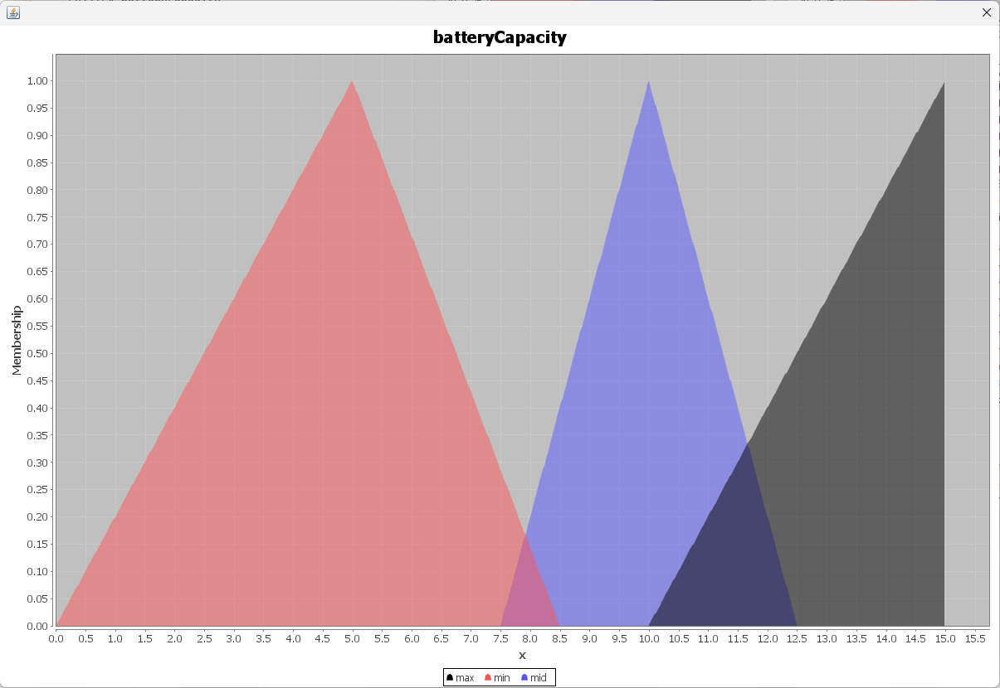
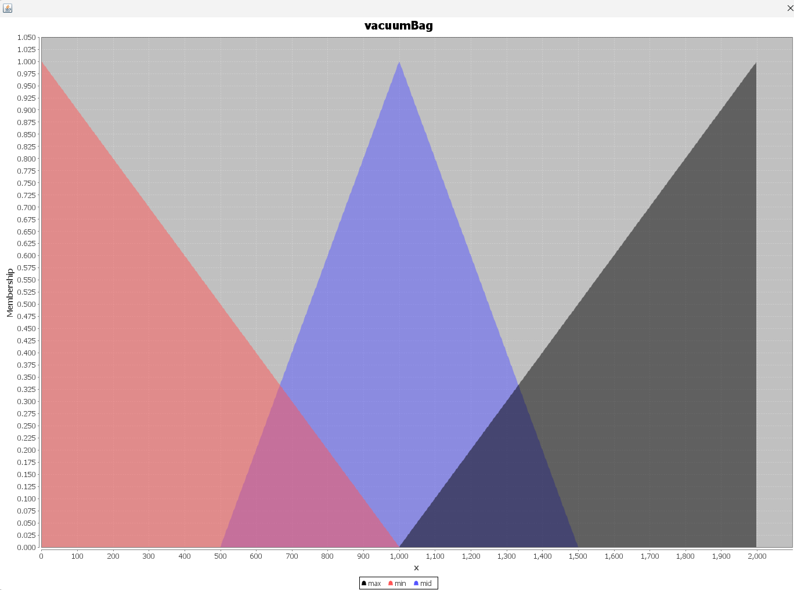
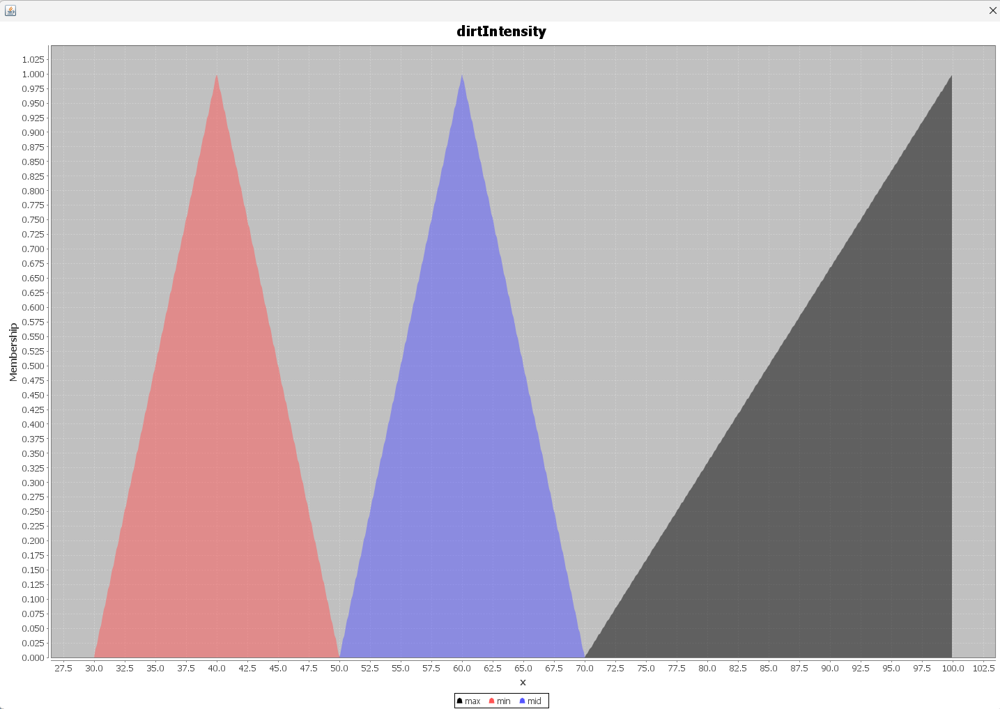

This is an extended version of the example on https://github.com/jason-lang/jason/tree/master/examples/cleaning-robots. In this extended version, each cleaning robot (R1 and R3) is guided by (fuzzy-)BDI agents that rely on constraints like vacuum capacity and battery power to evaluate the perceived dirt intensity, randomly generated within a range of 0.0 to 100.0 for each grid cell. The two robots begin cleaning from opposite map corners, each responsible for half of the area. Once a robot finishes its section and reaches the map's centre (marked as R2), it signals the other robot to take over its area (if the other robot has enough resources). While working in their assigned zones, the robots continuously monitor their vacuum capacity and battery levels. This approach allows them to dynamically adjust their vacuum power in a fuzzified manner, based on factors like (fuzzified) vacuum capacity, battery level, and dirt intensity. The goal is not to clean the entire grid but to efficiently manage resources and make the space appear fairly clean. By means of fairly clean, if the dirt intensity is close to 100, the robots apply more vacuum power while it is lesser, being closer to 0. In this way, the robots try to balance their resource usage whilst providing a reasonable cleaning service.

**Fuzzy rules and membership functions are given below, respectively.**

```IF batteryPower IS min AND vacuumBag IS min AND dirtIntensity IS min THEN burnGarb(50);
   IF batteryPower IS min AND vacuumBag IS min AND dirtIntensity IS mid THEN burnGarb(70);
   IF batteryPower IS min AND vacuumBag IS min AND dirtIntensity IS max THEN burnGarb(90);

   IF batteryPower IS min AND vacuumBag IS mid AND dirtIntensity IS min THEN burnGarb(50);
   IF batteryPower IS min AND vacuumBag IS mid AND dirtIntensity IS mid THEN burnGarb(70);
   IF batteryPower IS min AND vacuumBag IS mid AND dirtIntensity IS max THEN burnGarb(90);

   IF batteryPower IS min AND vacuumBag IS max AND dirtIntensity IS min THEN burnGarb(50);
   IF batteryPower IS min AND vacuumBag IS max AND dirtIntensity IS mid THEN burnGarb(70);
   IF batteryPower IS min AND vacuumBag IS max AND dirtIntensity IS max THEN burnGarb(90);

   IF batteryPower IS mid AND vacuumBag IS min AND dirtIntensity IS min THEN burnGarb(50);
   IF batteryPower IS mid AND vacuumBag IS min AND dirtIntensity IS mid THEN burnGarb(70);
   IF batteryPower IS mid AND vacuumBag IS min AND dirtIntensity IS max THEN burnGarb(90);

   IF batteryPower IS mid AND vacuumBag IS mid AND dirtIntensity IS min THEN burnGarb(50);
   IF batteryPower IS mid AND vacuumBag IS mid AND dirtIntensity IS mid THEN burnGarb(70);
   IF batteryPower IS mid AND vacuumBag IS mid AND dirtIntensity IS max THEN burnGarb(90);

   IF batteryPower IS mid AND vacuumBag IS max AND dirtIntensity IS min THEN burnGarb(50);
   IF batteryPower IS mid AND vacuumBag IS max AND dirtIntensity IS mid THEN burnGarb(70);
   IF batteryPower IS mid AND vacuumBag IS max AND dirtIntensity IS max THEN burnGarb(90);

   IF batteryPower IS max AND vacuumBag IS min AND dirtIntensity IS min THEN burnGarb(50);
   IF batteryPower IS max AND vacuumBag IS min AND dirtIntensity IS mid THEN burnGarb(70);
   IF batteryPower IS max AND vacuumBag IS min AND dirtIntensity IS max THEN burnGarb(90);

   IF batteryPower IS max AND vacuumBag IS mid AND dirtIntensity IS min THEN burnGarb(50);
   IF batteryPower IS max AND vacuumBag IS mid AND dirtIntensity IS mid THEN burnGarb(100);
   IF batteryPower IS max AND vacuumBag IS mid AND dirtIntensity IS max THEN burnGarb(100);

   IF batteryPower IS max AND vacuumBag IS max AND dirtIntensity IS min THEN burnGarb(70);
   IF batteryPower IS max AND vacuumBag IS max AND dirtIntensity IS mid THEN burnGarb(100);
   IF batteryPower IS max AND vacuumBag IS max AND dirtIntensity IS max THEN burnGarb(100);
```






