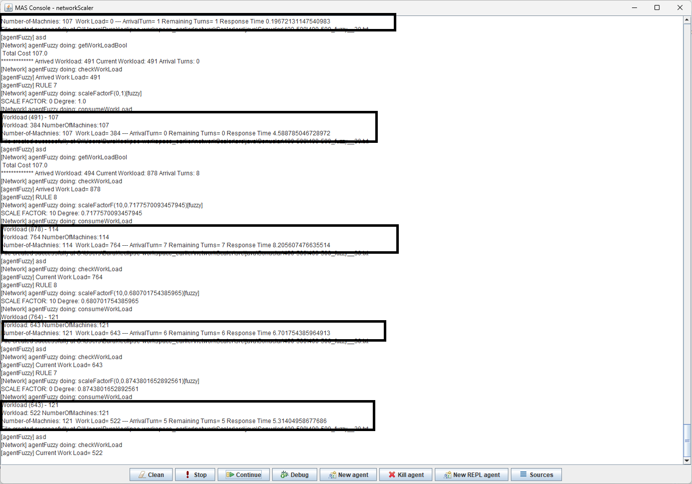

This case study is inspired by [1]. The system is initialised by 100 computing sources (numberOfMachines). On each turn, a random workload is generated between the ranges of 250-350, 250-500, 350-450 and 400-500. 
The (fuzzy-)BDI agent reasons for the increasing/decreasing workload and decides to add or deduct the computing sources to finish it as soon as possible.

9 rules (fuzzy plans) are written for both agents.  On the boolean side, scale factors assigned to each plan are fixed. Considering the response time, these scale factors are arranged on the fuzzy side. Response time is calculated by (total) workload/numberOfMachines.


```
   IF workLoad IS low AND responseTime IS good THEN scaleFactorF(-15);
   IF workLoad IS low AND responseTime IS ok THEN scaleFactorF(-10);
   IF workLoad IS low AND responseTime IS bad THEN scaleFactorF(10);
   IF workLoad IS medium AND responseTime IS good THEN scaleFactorF(-10);
   IF workLoad IS medium AND responseTime IS ok THEN scaleFactorF(0);
   IF workLoad IS medium AND responseTime IS bad THEN scaleFactorF(10);
   IF workLoad IS high AND responseTime IS good THEN scaleFactorF(0);
   IF workLoad IS high AND responseTime IS ok THEN scaleFactorF(10);
   IF workLoad IS high AND responseTime IS bad THEN scaleFactorF(15);

```


[1] Weyns, D. (2020). An introduction to self-adaptive systems: A contemporary software engineering perspective. John Wiley & Sons.
