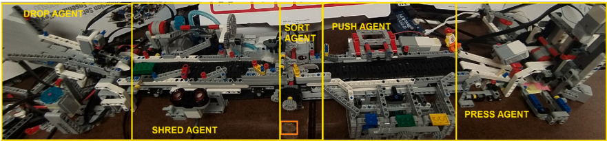
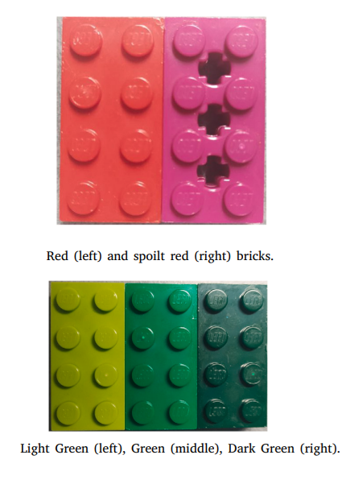
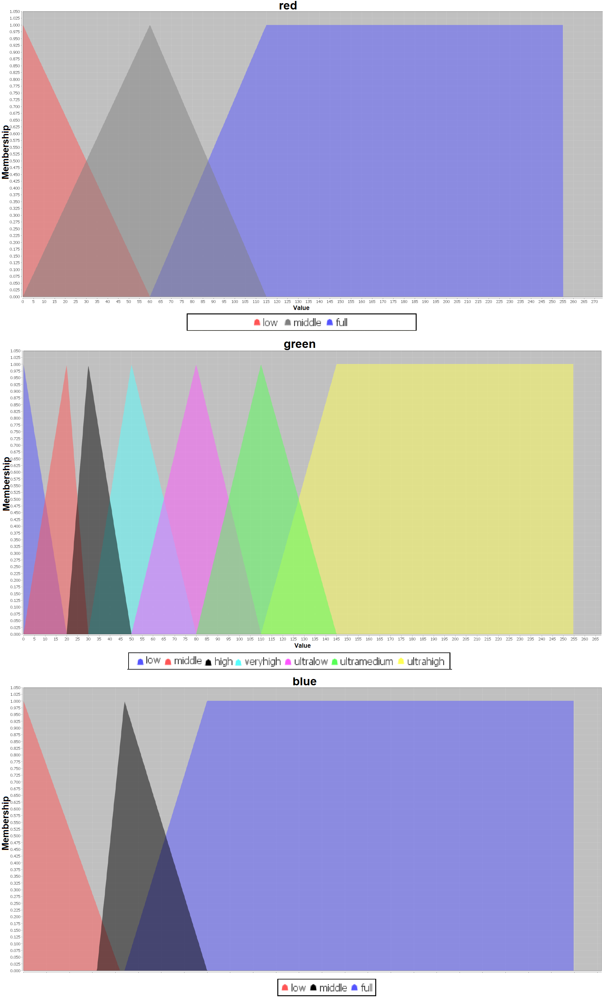
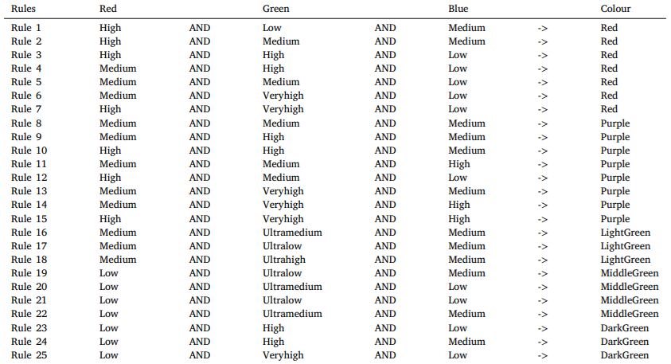

The system emulates the behaviors and processes typical of industrial CPS classes but simplifies their cyber and physical components to enable experimentation with fuzzy logic and agent-based approaches. The case study models a sauce production process, focusing on using red tomatoes as the primary ingredient. While a limited number of spoiled tomatoes can be tolerated, an excessive amount negatively impacts product quality. Green peppers can also be included, creating a blend of red tomatoes and green peppers for various sauce types. Additionally, peppers of different green shades may be added.

Before incorporating ingredients, the system must identify and remove spoiled tomatoes. However, the colour sensor operates under uncertainty due to its limited ability to process colour information. To address this challenge, a fuzzy-logic-based method effectively manages the inherent ambiguities.

The fuzzification process was made on the Sort Agent. It should correctly distinguish and label the colours, such as red, spoiled red, light green, green and dark green, shown below:

** Fuzzy Membership Functions and Rules are given below: **

