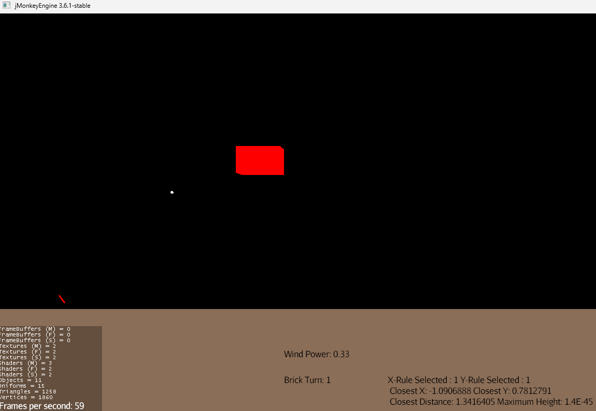
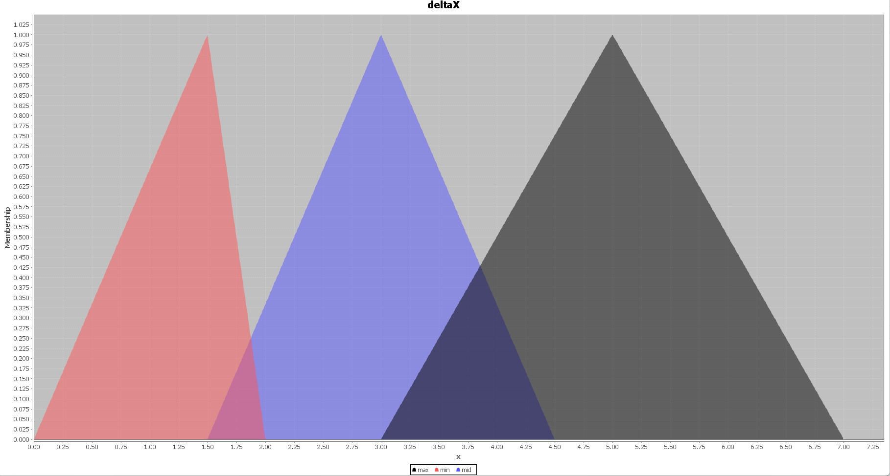
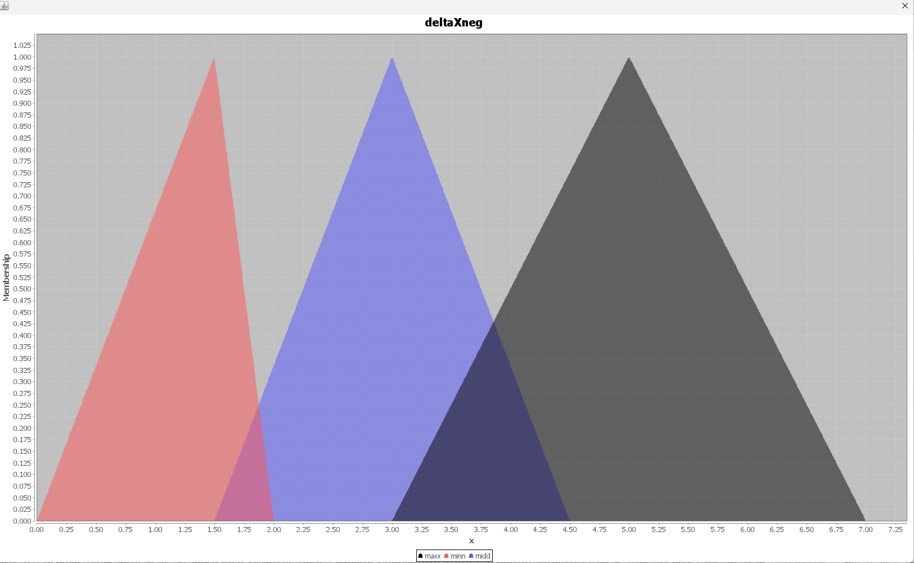
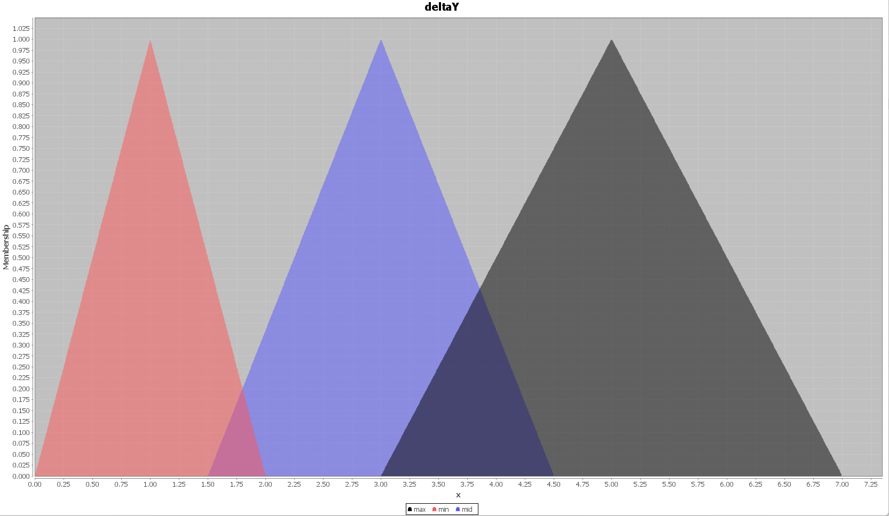
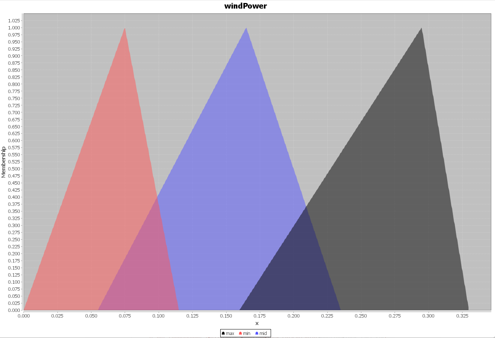

      
Turret Planet is a nostalgic game inspired by 80s Atari classics and built using the jMonkeyEngine. It revolves around a turret situated on a rotating planet, tasked with shooting floating boxes in the sky. Designed to challenge players with a competitive AI, the game incorporates wind power as a factor influencing the turret's shooting precision. The AI calculates shots by accounting for wind velocity and the bullet's trajectory, aiming for maximum accuracy based on X and Y coordinates. The game contrasts two AI approaches: the traditional BDI model, which uses boolean logic for decision-making, and the fuzzy-BDI model, which leverages gradual adjustments to enhance the turret's adaptability to dynamic conditions. **The fuzzy membership functions and rules are given below.**

      
      
      IF windPower IS min THEN considerWindPowerF(1);
      IF windPower IS mid THEN considerWindPowerF(4.1);
      IF windPower IS max THEN considerWindPowerF(8.2);

      IF deltaX IS min THEN degAndVelX(-0.5);
      IF deltaX IS mid THEN degAndVelX(-0.7);
      IF deltaX IS max THEN degAndVelX(-0.9);

      IF deltaXneg IS min THEN degAndVelX(0.5);
      IF deltaXneg IS mid THEN degAndVelX(0.7);
      IF deltaXneg IS max THEN degAndVelX(1.0);

      IF deltaY IS min THEN degAndVelY(-4.0);
      IF deltaY IS mid THEN degAndVelY(-5.0);
      IF deltaY IS max THEN degAndVelY(-5.5);

      IF deltaYneg IS min THEN degAndVelY(2.5);
      IF deltaYneg IS mid THEN degAndVelY(3.5);
      IF deltaYneg IS max THEN degAndVelY(4.5);
